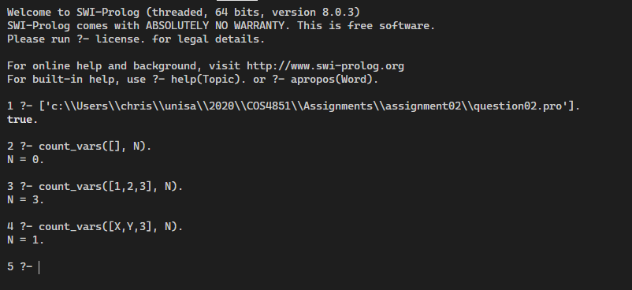
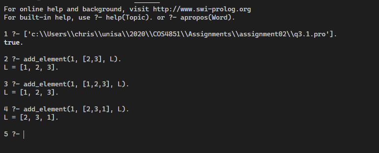
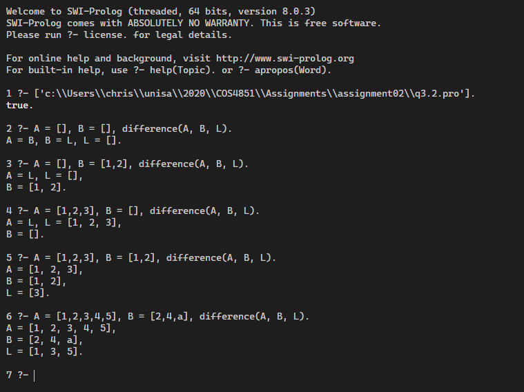
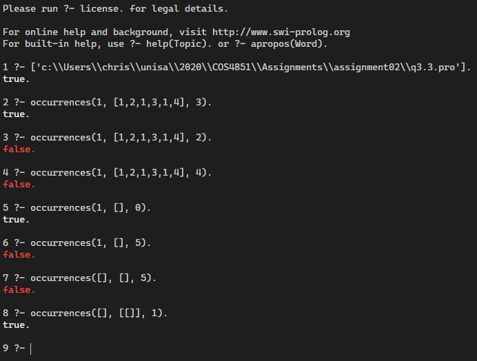
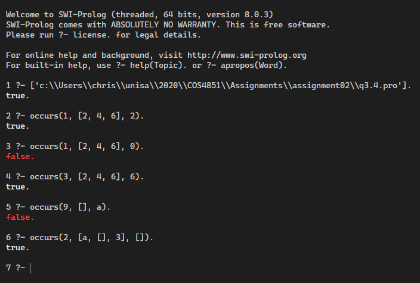
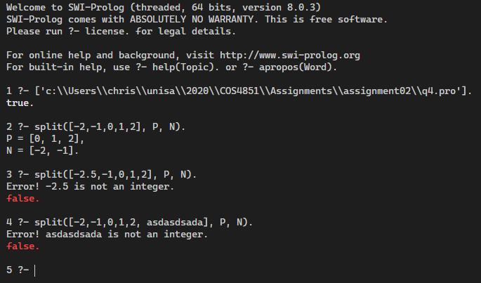
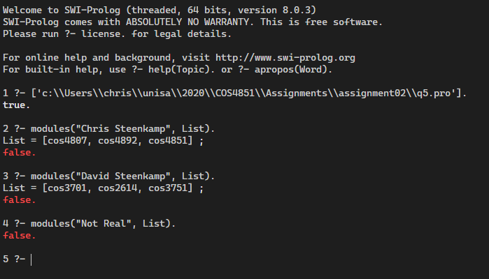
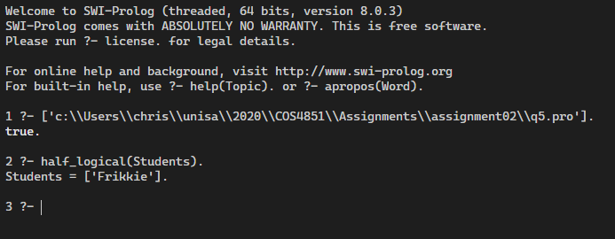
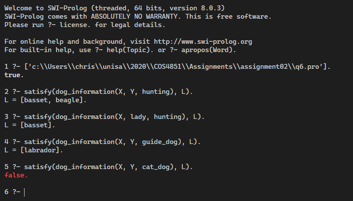

## Question 1

### 1.1

In the first instance, the goal home(john) is instantiating the variable X with the value john, which the progam then uses to see if it can satisfy out(john). It cannot, which implies that not(out(john) is true and so the goal home(john) resolves to being true.

In the second instance, the goal home(X) does not instantiate the variable X (meaning X is existentially quantified) and so the goal is: is there an X such that home(X). In order for this to be true, it must be true that: not(there exists an X such that out(X)), but the negation changes the quantification from existential to universal so the goal is actually interpreted as: for all X: not out(X), which is saying is it the case that nobody is out? Which is false because we have out(susan).

### 1.2

The phenomenon is caused by the Closed World Assumption, which is the assumption that all facts which are true have been stated in the program, allowing Prolog to infer that unstated facts are untrue.

## Question 2

```prolog
% non-recursive function which gets called by the user.
% starts by calling the recursive function with a count of 0.
count_vars(L, N) :-
    count_vars_rec(L, 0, N).

% If the input list is empty, use the current calculated value of N.
count_vars_rec([], N, N).

% Tail recursive function
% If the item at the head of the list is instantiated then add one to
% the current count and pass this sum into subsequent calls.
% Otherwise just pass the current count as an argument.
count_vars_rec([H|T], C, N) :-
    var(H), !, count_vars_rec(T, C, N)
    ;
    CC is C + 1,
    count_vars_rec(T, CC, N).
```



## Question 3

### 3.1

```prolog
add_element(X,L,L1) :-
    member(X, L), !, L1=L
    ;
    L1=[X|L].
```



### 3.2

```prolog
% The difference of the empty set to any other set is the empty set.
% This is needed because setof predicate fails when an empty set is 
% given as input to A. Predicate findall would get around this but
% would return duplicates if they given inputs are lists, not sets.
difference([], _, []) :- !.
```

$\pagebreak$

```prolog
% The difference of any set X with the empty set is the original set X.
% This precicate avoids unnecessary computation if B is the empty set.
difference(A, [], A) :- !.

% Set L to the set of all X which are in A but not in B.
difference(A, B, L) :-
    setof(X, (member(X, A), not(member(X, B))), L).
```



### 3.3

```prolog
% If X is atomic, L is not a variable, and N is an integer, then
% return true if the number of occurrences of X in L is equal to N.
occurrences(X, L, N) :-
    atomic(X),
    nonvar(L),
    integer(N),
    !,
    % create list of all occurrences of X within L
    findall(X, member(X, L) , L2),
    % check that length of new list is equal to N
    length(L2, N).
```



### 3.4

```prolog
% nothing occurs anywhere in an empty list.
occurs(_, [], _) :- !, fail.

% If X is atomic, L is not a variable, and N is an integer,
% then return true if X occurs at postition N in L.
occurs(N, L, X) :-
    integer(N),
    nonvar(L),
    atomic(X),
    !,
    % create a "list" term which has as arguments all the elements of L
    L2 =.. [list|L],
    % determine if X is the Nth argument of the newly created term L2
    arg(N, L2, X).
```



### 3.5.1

```prolog
in_list(X, [X|_]).

in_list(X, [_|T]) :-
    in_list(X, T).

% the difference between the empty set and anything is the empty set.
difference([], _, []).

% if an element is in A and also in the resultant list L then it mustn't be in B.
% the remaining elements of A and L must also be processed and checked.
difference([AH|AT], B, [AH|LT]) :-
    not(in_list(AH, B)),
    difference(AT, B, LT).

% if an element of A is also in B, then it can't be in L, so we process the
% remaining elements of A.
difference([AH|AT], B, L) :-
    in_list(AH, B),
    difference(AT, B, L).
```


### 3.5.2

```prolog
% number of occurrences of anything in an empty list is 0.
occurrences(_, [], 0).

% number of occurrences of X when X is the head is equal
% to 1 + the number of occurrences of X in the tail.
occurrences(X, [X|T], N) :-
    occurrences(X, T, N2),
    !,
    N is 1 + N2.

% number of occurrences of X when X is not the head is
% equal to the number of occurrences of X in the tail.
occurrences(X, [_|T], N) :-
    occurrences(X, T, N).
```


## Question 4

```prolog
split([],[],[]).

% non integers will fail with an error message.
split([H|_], _, _) :-
    not(integer(H)),!,write("Error! "), write(H), write(" is not an integer."),nl,fail.

% if a number can be the head of Postives, then it is at least 0.
split([H|T],[H|PosTail],Negatives) :-
    H >= 0,!,split(T,PosTail, Negatives).

% otherwise, if a number can be the head of Negatives, then it is < 0.
split([H|T],Positives,[H|NegTail]) :-
    split(T,Positives, NegTail).
```



## Question 5

### 5.1

```prolog
student('Clancy', 'Keira', hons, [cos4807,cos4840,cos4851]).
student('Steenkamp', 'Chris', hons, [cos4807,cos4892,cos4851]).
student('Frikkadel', 'Frikkie', hons, [cos4840,cos4892,cos4851]).
student('Steenkamp', 'David', und, [cos3701,cos2614, cos3751]).
student('Clancy', 'Jayson', und, [cos2601,cos2611,cos2614]).

% True when First is the prefix of Name.
get_first_name(Name, First) :-
    name(Name, FullName),
    name(First, FirstName),
    append(FirstName, _, FullName).


% True when Surname is the suffix of Name.
get_surname(Name, Surname) :-
    name(Name, FullName),
    name(Surname, Last),
    append(_, Last, FullName).


% Get the list of modules for all students with full name Name.
modules(Name, List) :-
    student(Surname, First, _, List),
    get_first_name(Name, First),
    get_surname(Name, Surname).
```



### 5.2

```prolog
% list all students who take cos4851 but not cos4807
half_logical(Names) :-
    findall(FirstName, (student(_, FirstName, _, Modules), 
        member(cos4851, Modules), not(member(cos4807, Modules))), Names).
```



## Question 6

```prolog
breed(zappa, labrador).
breed(penka, labrador).
breed(oscar, beagle).
breed(domino, dalmation).
breed(daisy, boxer).
breed(snoopy, beagle).
breed(lady, basset).
breed(gina, german_shepherd).

service(beagle, hunting).
service(basset, hunting).
service(labrador, guide_dog).
service(german_shepherd, watch_dog).
service(boxer, guard_dog).
service(dalmation, carriage_dog).

% Get the breed, name and service of a dog in the database.
dog_information(Breed, Name, Service) :-
  service(Breed, Service),
  breed(Name, Breed).


% Given a ternary predicate p(X,Y,Z), return the set of X for which Y and Z are true.
satisfy(P,L) :-
  functor(P, F, 3),
  arg(1, P, X),
  arg(2, P, Y),
  arg(3, P, Z),
  T =.. [F|[X, Y, Z]],
  setof(X, Y ^ Z ^ T, L).
```



## Question 7

Comparison Operator|Description
:-:|:--
X = Y |True if X and Y match. If X and Y are contants, they match only if they are the same object. If X is a variable and Y is anything, X is instantiated to Y and the two terms will match. If X and Y are structures then they match if their pricinple functors are the same and all corresponding components match.
X == Y | True if X and Y are identical. If X and Y are compound then the order of arguments and predicates must be the same for them to be identical.
X \== Y | True if X and Y are not identical.
X =:= Y | True if X and Y are arithmetically equal. If either X or Y (or both) represent expressions then the expressions are first evaluated and then the results are compared.
X =\= Y | True if X and Y are not arithmetically equal.
X < Y | True if X arithmetically prececedes Y. If X or Y are expressions, then they will first be evaluated and then their results will be compared.(Other operators are <, =<, >=)
X @< Y | True if the term X precedes the term Y. This allows comparisons of non-numeric terms, including compound structures. (other operators are @>, @=<, @>=)
