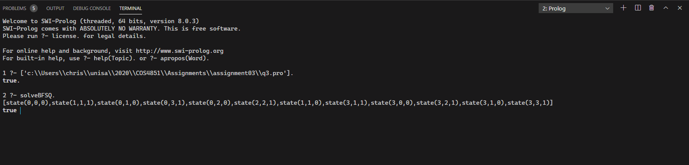

## Question 1

```prolog
% States represent
% [Soldier1, Soldier2, Soldier3, Soldier4, Torch]

% All soldiers are initally on the north side of the bridge.
initial([n,n,n,n,n]).

% The goal is to get all soldiers to the south side of the bridge.
goal([s,s,s,s,s]).

% Soldier 1 and 2 cross with the torch in 25 minutes.
move([S1, S1, S3, S4, S1], [S11, S11, S3, S4, S11], C) :-
    cross(S1, S11),
    C is 25.

% Soldier 1 and 3 cross with the torch in 25 minutes.
move([S1, S2, S1, S4, S1], [S11, S2, S11, S4, S11], C) :-
    cross(S1, S11),
    C is 25.

% Soldier 1 and 4 cross with the torch in 25 minutes.
move([S1, S2, S3, S1, S1], [S11, S2, S3, S11, S11], C) :-
    cross(S1, S11),
    C is 25.

% Soldier 2 and 3 cross with the torch in 20 minutes.
move([S1, S2, S2, S4, S2], [S1, S21, S21, S4, S21], C) :-
    cross(S2, S21),
    C is 20.

% Soldier 2 and 4 cross with the torch in 10 minutes.
move([S1, S2, S3, S2, S2], [S1, S21, S3, S21, S21], C) :-
    cross(S2, S21),
    C is 10.

% Soldier 3 and 4 cross with the torch in 20 minutes.
move([S1, S2, S3, S3, S3], [S1, S2, S31, S31, S31], C) :-
    cross(S3, S31),
    C is 20.

% Soldier 1 returns with the torch in 25 minutes.
move([S11, S2, S3, S4, S11], [S1, S2, S3, S4, S1], C) :-
    cross(S1, S11),
    C is 25.

% Soldier 2 returns with the torch in 10 minutes.
move([S1, S21, S3, S4, S21], [S1, S2, S3, S4, S2], C) :-
    cross(S2, S21),
    C is 10.

% Soldier 3 returns with the torch in 20 minutes.
move([S1, S2, S31, S4, S31], [S1, S2, S3, S4, S3], C) :-
    cross(S3, S31),
    C is 20.

% Soldier 4 returns with the torch in 5 minutes.
move([S1, S2, S3, S41, S41], [S1, S2, S3, S4, S4], C) :-
    cross(S4, S41),
    C is 5.

% The bridge allows soldiers to cross from the north to the south.
cross(n,s).

solve :-
    initial(Start),
    depthfirst([], Start, Solution, C),
    write(Solution),
    write(' would take '),
    write(C),
    write(' minutes.'),
    nl.

% If the current node is a goal then the cost is 0.
depthfirst(Path, Node, [Node|Path], C) :-
    goal(Node),
    C is 0.

% Perform depth first search a goal, counting how long it takes.
% Do not process paths which have already been explored.
depthfirst(Path, Node, Solution, C) :-
    move(Node, Node1, MoveCost),
    \+(member(Node1, Path)),
    depthfirst([Node|Path], Node1, Solution, RecMove),
    C is MoveCost + RecMove.
```


There are two optimal paths which each take 60 minutes.

[[s,s,s,s,s],[s,n,s,n,n],[s,s,s,n,s],[n,s,n,n,n],[n,s,n,s,s],[n,n,n,n,n]]

and

[[s,s,s,s,s],[s,n,s,n,n],[s,n,s,s,s],[n,n,n,s,n],[n,s,n,s,s],[n,n,n,n,n]]


## Question 2

```prolog
% Determine the sequence of moves to move N disks from
% an origin peg to a destination peg, using a temporary
% peg as a helper. Print the number of moves required.
tower_of_hanoi(N) :-
    move(N, origin, destination, temp, 0, C),
    write('Moving '),
    write(N),
    write(' disks would take '),
    write(C),
    write(' moves.'),
    nl.

% When there is more than one disk on the origin peg,
% move the top N - 1 disks to temp, then move the remaining
% disk to destination peg, then move N - 1 disks from temp
% peg to destination peg. Use tail recursion to count moves.
move(N, Origin, Destination, Temp, Acc, Count) :-
    N > 1,
    M is N - 1,
    move(M, Origin, Temp, Destination, Acc, C1),
    move(1, Origin, Destination, Temp, C1, C2),
    move(M, Temp, Destination, Origin, C2, Count).

% Base case when there is only one disk on a peg to move.
move(1, Origin, Destination, _, Acc, Count) :-
    write('Move top disk from '),
    write(Origin),
    write(' to '),
    write(Destination),
    nl,
    Count is Acc + 1.
```


## Question 3

```prolog
% States are represented by number of missionaries, cannibals and boat on north shore
initial(state(3,3,1)).

% All missionaries and cannibals + boat is across the river.
goal(state(0,0,0)).

% Breadth first algorithm which uses a queue to store the paths to be explored.
% It does this by asserting generated nodes at the end of the database and then
% retracts them as they are processed.
solveBFSQ :-
    initial(Start),
    % Start by pushing the initial starting node into the queue.
    assertz(queue([Start])),
    bfsq(Solution),
    write(Solution),nl.

% If goal node is in path then we have a solution.
bfsq([Node|Path]) :-
    queue([Node|Path]),
    goal(Node),
    % Clear the queue to prevent the remaining unexplored paths from being
    % processed (unless we want to generate alternative solutions).
    clear_queue.


% Perform breadth-first by generating all potential successor nodes
% and pushing them into the queue for processing.
bfsq(Solution) :-
    % Find the first path which is in the queue.
    queue(Path),
    % We don't want to backtrack if the current path is a dead-end.
    !,
    % generate all successor nodes into the queue
    generate_successors(Path),
    % Pop this path from the queue as we have processed it.
    retract(queue(Path)),
    bfsq(Solution).

% Remove all existing paths from the queue.
clear_queue :-
    findall(_, (queue(Path), retract(queue(Path))), _).

% find all successor nodes from Node and add them to the queue only if they are
% not already part of any existing path.
generate_successors([Node|Path]) :-
    s(Node, NewNode),
    % make sure there are no other paths which already contain NewNode.
    not(bagof(_, (queue(OtherPath),member(NewNode, OtherPath)), _)),
    % Add NewNode to head of path and push this new path into the queue.
    assertz(queue([NewNode, Node | Path])),
    % force a failure to backtrack and generate the next successor.
    fail;
    % If there no (more) successors we are done and can return.
    true.

% State transition is valid if there is a safe move from S1 to S2
s(S1, S2) :-
    move(S1, S2),
    safe(S2).

% Move one missionary across
move(state(M,C,1), state(M2,C,0)) :-
    M > 0,
    M2 is M - 1.

% Move two missionaries across
move(state(M,C,1), state(M2,C,0)) :-
    M > 1,
    M2 is M - 2.

% Move one cannibal across
move(state(M,C,1), state(M,C2,0)) :-
    C > 0,
    C2 is C - 1.

% Move two cannibals across
move(state(M,C,1), state(M,C2,0)) :-
    C > 1,
    C2 is C - 2.

% Move one of each across
move(state(M,C,1), state(M2,C2,0)) :-
    C > 0,
    M > 0,
    C2 is C - 1,
    M2 is M - 1.

% Move one missionary back
move(state(M,C,0), state(M2,C,1)) :-
    M < 3,
    M2 is M + 1.

% Move two missionaries back
move(state(M,C,0), state(M2,C,1)) :-
    M < 2,
    M2 is M + 2.

% Move one cannibal back
move(state(M,C,0), state(M,C2,1)) :-
    C < 3,
    C2 is C + 1.

% Move two cannibals back
move(state(M,C,0), state(M,C2,1)) :-
    C < 2,
    C2 is C + 2.

% Move one of each back
move(state(M,C,0), state(M2,C2,1)) :-
    C < 3,
    M < 3,
    C2 is C + 1,
    M2 is M + 1.

% All missionaries are on one side.
safe(state(3,_,_)).

% All missionaries are on the other side.
safe(state(0,_,_)).

% An even number of missionaries and cannibals on either side.
safe(state(X,X,_)).
```



## Question 4