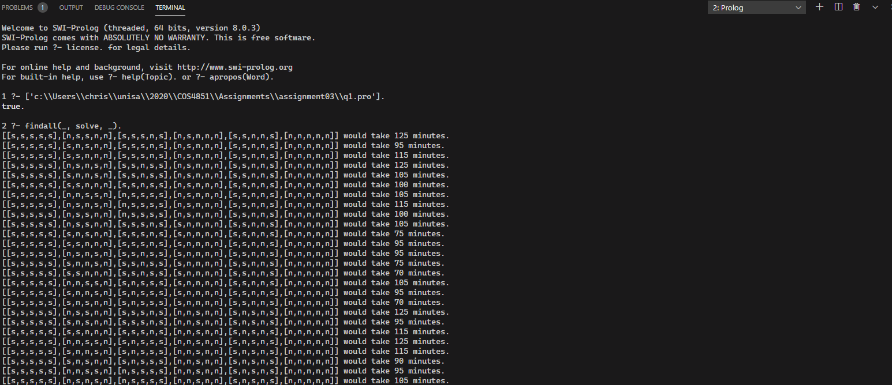
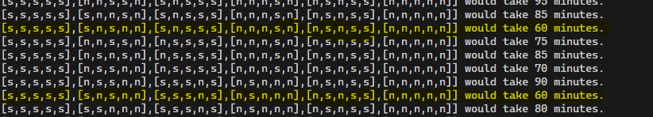
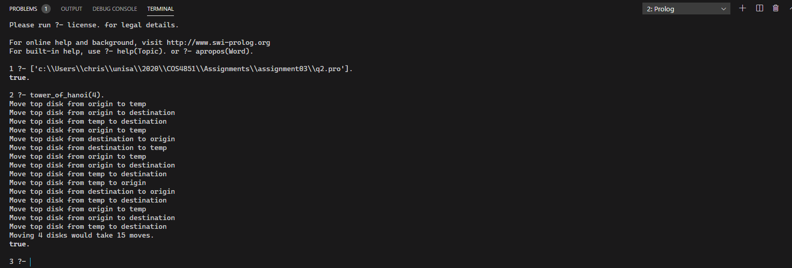

## Question 1

```prolog
% States represent
% [Soldier1, Soldier2, Soldier3, Soldier4, Torch]

% All soldiers are initally on the north side of the bridge.
initial([n,n,n,n,n]).

% The goal is to get all soldiers to the south side of the bridge.
goal([s,s,s,s,s]).

% Soldier 1 and 2 cross with the torch in 25 minutes.
move([S1, S1, S3, S4, S1], [S11, S11, S3, S4, S11], C) :-
    cross(S1, S11),
    C is 25.

% Soldier 1 and 3 cross with the torch in 25 minutes.
move([S1, S2, S1, S4, S1], [S11, S2, S11, S4, S11], C) :-
    cross(S1, S11),
    C is 25.

% Soldier 1 and 4 cross with the torch in 25 minutes.
move([S1, S2, S3, S1, S1], [S11, S2, S3, S11, S11], C) :-
    cross(S1, S11),
    C is 25.

% Soldier 2 and 3 cross with the torch in 20 minutes.
move([S1, S2, S2, S4, S2], [S1, S21, S21, S4, S21], C) :-
    cross(S2, S21),
    C is 20.

% Soldier 2 and 4 cross with the torch in 10 minutes.
move([S1, S2, S3, S2, S2], [S1, S21, S3, S21, S21], C) :-
    cross(S2, S21),
    C is 10.

% Soldier 3 and 4 cross with the torch in 20 minutes.
move([S1, S2, S3, S3, S3], [S1, S2, S31, S31, S31], C) :-
    cross(S3, S31),
    C is 20.

% Soldier 1 returns with the torch in 25 minutes.
move([S11, S2, S3, S4, S11], [S1, S2, S3, S4, S1], C) :-
    cross(S1, S11),
    C is 25.

% Soldier 2 returns with the torch in 10 minutes.
move([S1, S21, S3, S4, S21], [S1, S2, S3, S4, S2], C) :-
    cross(S2, S21),
    C is 10.

% Soldier 3 returns with the torch in 20 minutes.
move([S1, S2, S31, S4, S31], [S1, S2, S3, S4, S3], C) :-
    cross(S3, S31),
    C is 20.

% Soldier 4 returns with the torch in 5 minutes.
move([S1, S2, S3, S41, S41], [S1, S2, S3, S4, S4], C) :-
    cross(S4, S41),
    C is 5.

% The bridge allows soldiers to cross from the north to the south.
cross(n,s).


solve :-
    initial(Start),
    depthfirst([], Start, Solution, C),
    write(Solution),
    write(' would take '),
    write(C),
    write(' minutes.'),
    nl.


% If the current node is a goal then the cost is 0.
depthfirst(Path, Node, [Node|Path], C) :-
    goal(Node),
    C is 0.


% Perform depth first search a goal, counting how long it takes.
% Do not process paths which have already been explored.
depthfirst(Path, Node, Solution, C) :-
    move(Node, Node1, MoveCost),
    \+(member(Node1, Path)),
    depthfirst([Node|Path], Node1, Solution, RecMove),
    C is MoveCost + RecMove.
```



There are two optimal paths which take 60 minutes.

[[s,s,s,s,s],[s,n,s,n,n],[s,s,s,n,s],[n,s,n,n,n],[n,s,n,s,s],[n,n,n,n,n]]

and

[[s,s,s,s,s],[s,n,s,n,n],[s,n,s,s,s],[n,n,n,s,n],[n,s,n,s,s],[n,n,n,n,n]]



## Question 2

```prolog
% Determine the sequence of moves to move N disks from
% an origin peg to a destination peg, using a temporary
% peg as a helper. Print the number of moves required.
tower_of_hanoi(N) :-
    move(N, origin, destination, temp, 0, C),
    write('Moving '),
    write(N),
    write(' disks would take '),
    write(C),
    write(' moves.'),
    nl.

% When there is more than one disk on the origin peg,
% move the top N - 1 disks to temp, then move the remaining
% disk to destination peg, then move N - 1 disks from temp
% peg to destination peg. Use tail recursion to count moves.
move(N, Origin, Destination, Temp, Acc, Count) :-
    N > 1,
    M is N - 1,
    move(M, Origin, Temp, Destination, Acc, C1),
    move(1, Origin, Destination, Temp, C1, C2),
    move(M, Temp, Destination, Origin, C2, Count).

% Base case when there is only one disk on a peg to move.
move(1, Origin, Destination, _, Acc, Count) :-
    write('Move top disk from '),
    write(Origin),
    write(' to '),
    write(Destination),
    nl,
    Count is Acc + 1.
```


